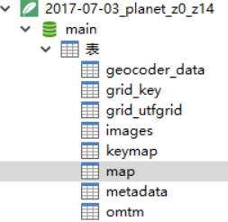
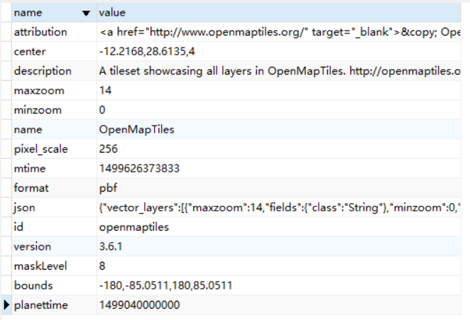
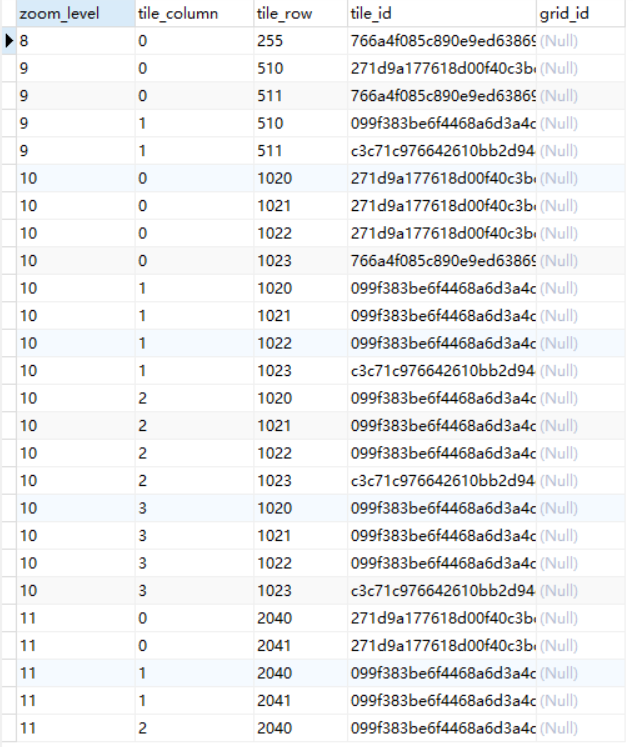
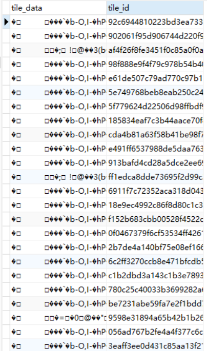
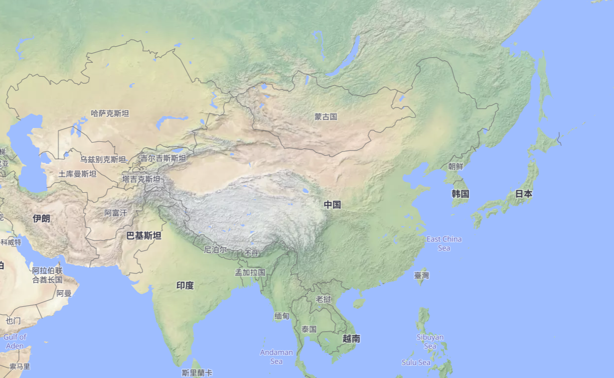
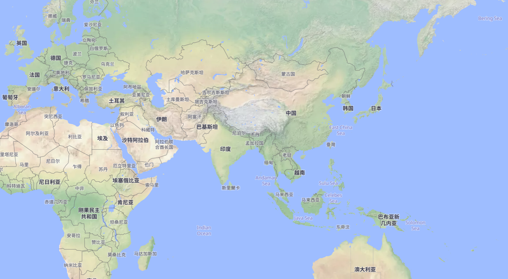
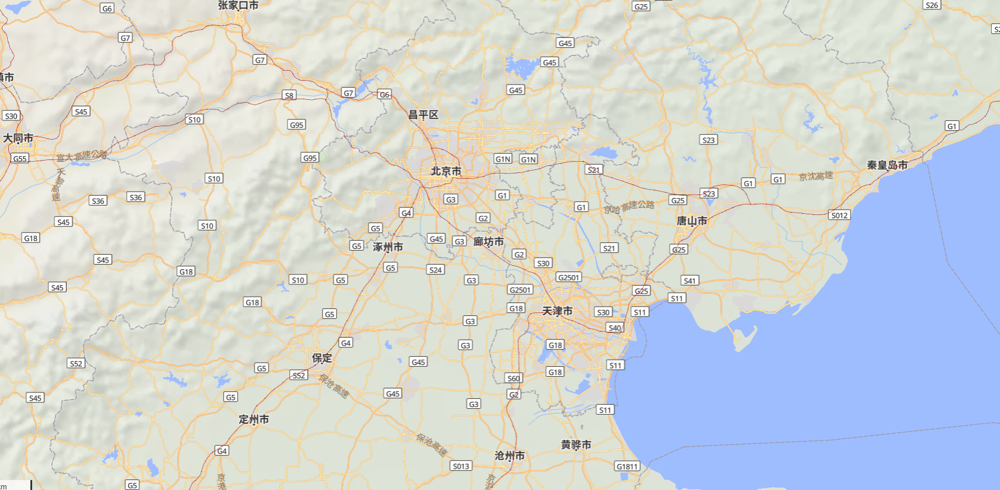
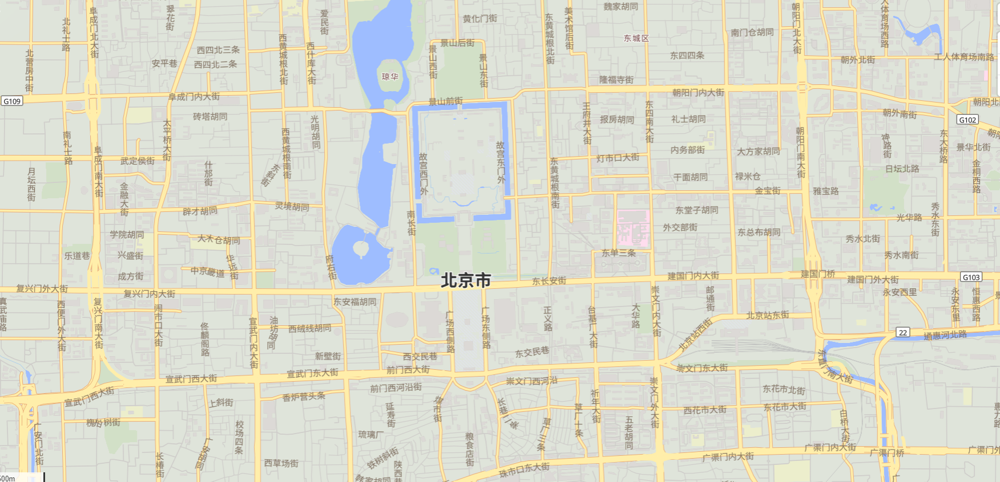
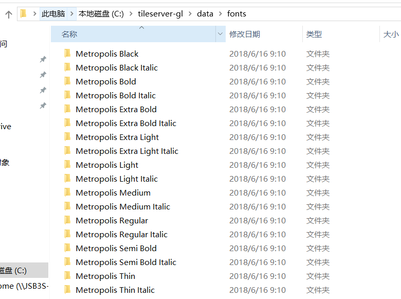
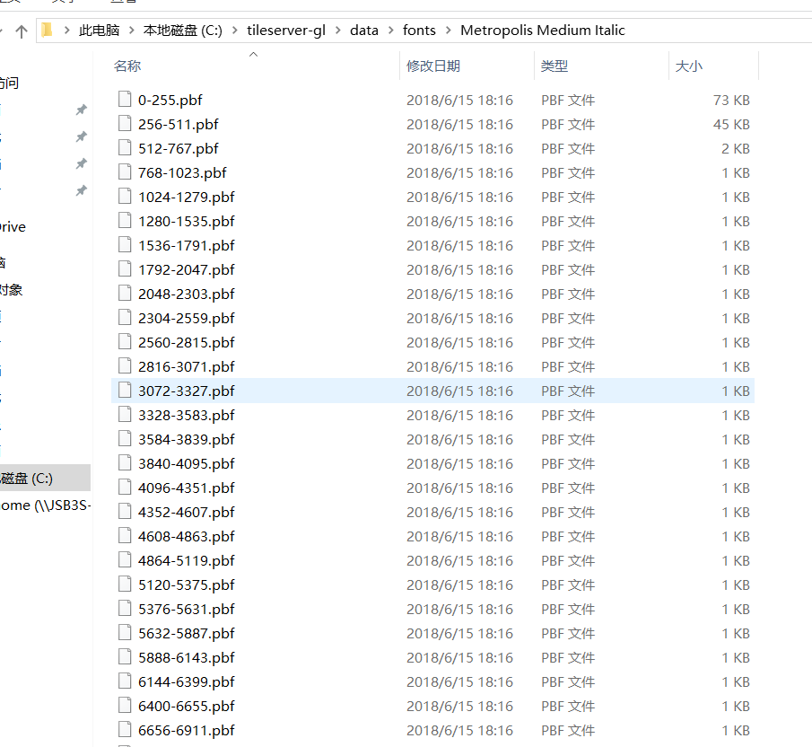

# 如何在内网环境搭建GIS服务器

[Mapbox](https://www.mapbox.com)是一个支持自定义的在线地图服务，它支持高度自定义各种地图元素，比如，道路、水系、绿地、建筑物、背景色等。我们可以使用Mapbox Studio完成地图元素的个性化编辑，之后将编辑好的样式表上传至Mapbox服务器，然后就可以在自己的客户端使用Mapbox提供的地图服务来使用自定义的地图了。

但是Mapbox的地图服务是在线服务，无法在内网环境下运行。那么如何在内网环境中能够实现类似于Mapbox的地图效果呢？下面我们来一步一步的进行介绍。

为了实现GIS服务，我们需要准备以下内容：
1. GIS服务软件
1. 地图数据
1. 自定义的地图样式表
1. 在GIS服务上进行二次开发的工具

下面我们逐一进行介绍

## GIS服务软件
我们使用tileserver-gl来承载地图数据，软件的源代码可以在[Github](https://github.com/klokantech/tileserver-gl)找到。该软件可以通过GL样式渲染矢量或者栅格地图，它的服务器端采用Mapbox GL Native进行渲染。详细的文档可以参考[这里](http://tileserver.readthedocs.io)。

tileserver-gl提供了一个根据地图样式表实时渲染矢量地图数据的引擎。通过这个引擎我们就可以实现类似于Mapbox效果的自定义地图样式。

### 通过docker运行
安装tileserver-gl最简单的方法是通过docker。
1. 安装docker，最简单的方法是现在安装包在win10（需要支持hyper-v的版本）上直接安装。在内网linux上安装根据linux发行版的不同，需要下载一些rpm或者deb的包，然后离线安装，这里就不再赘述详细过程了，可以参照[这里](https://www.docker.com/community-edition)，把所有依赖的包都下载好，然后拷贝到内网安装即可。
1. 下载tileserver-gl镜像。首先用`docker pull klokantech/tileserver-gl`将镜像安装到本机，然后用`docker save -o tileserver.tar klokantech/tileserver-gl`其中`tileserver.tar`是保存的镜像文件名，可以自行修改。
1. 安装tileserver-gl镜像。将下载好的`tileserver.tar`文件拷贝到内网中，然后执行`docker load -i tileserver.tar`来进行安装。可以通过`docker images`来查看镜像是否成功安装。
1. 运行tileserver-gl。执行`docker run --rm -it -v //c/tileserver-gl:/data -p 8080:80 klokantech/tileserver-gl`可以启动tileserver-gl，其中`//c/tileserver-gl`是存放地图数据的路径，tileserver-gl会自动识别其中的地图文件并加载，如果文件夹中没有地图文件，tileserver-gl会自动下载一个瑞士苏黎世的地图文件并加载，`8080:80`是指将tileserver-gl镜像的80端口映射到本机的8080端口。镜像运行后就可以访问`http://localhost:8080`查看地图了。

### 通过node.js运行
tileserver-gl也可以通过npm来安装，首先需要安装node.js，必须是v6版本。然后运行`npm install -g tileserver-gl`完成安装。

tileserver-gl的部分依赖库必须在linux环境运行，因此无法在在windows平台安装。如果需要在Windows平台运行可以使用tileserver-gl-light，这个软件是纯js编写的，可以在最新版的node.js上运行，该软件与tileserver-gl相比，无法实现栅格地图的渲染，除此以外的功能完全一致。

地图下载完成后可以通过`tileserver-gl map.mbtiles`命令运行，其中map.mbtiles是下载好的地图文件。

## 地图数据
地图数据可以从[openmaptiles](https://openmaptiles.com/downloads/planet/)网站下载，该网站提供了OpenStreetMap、等高线（Contour）、山体阴影（Hillshade）、卫星地图（Satellite）等种类的地图数据下载，其中只有OpenStreetMap可以免费下载，其余均需要付费。地图可以按照区域单独下载，全球数据大约51GB。

下载的地图文件格式是`.mbtiles`，这种文件实际上是一个改了后缀名的sqlite数据库文件。用navicat打开这个数据库，其中包含了以下几个表：



其中metadata表存放了该数据库的一些详细信息，包括地图边界，地图文件格式，地图图层信息等。其中json字段定义的地图图层信息最为重要，在后续自定义地图时，可以根据这里提供的图层数据要素的名称来实现地图显示的自定义。



其中map表存地图分级以及每层级各个瓦片所对应的tile_id。



其中images表存放了tile_id到tile_data的对应关系，tile_data中存放的是OpenStreeMap地图的pbf格式文件。



### OSM地图
OSM地图数据可以直接从网站上下载，网站上提供大约延迟半年的OpenStreetMap地图数据。也可以从OpenStreetMap网站下载pbf格式的地图文件然后自行转换成mbtiles格式使用，openmaptiles提供了从pbf到mbtiles格式的转换工具，具体的方法可以参考[这里](https://github.com/openmaptiles/openmaptiles/blob/README.md)。转换的过程使用了docker-compose，以及一系列的docker镜像。如果需要转换整个地球的地图数据，需要100GB以上的临时存储空间，以及数小时的转换时间，因此如果对最新的地图数据没有特殊需求，建议直接下载使用mbtiles格式的数据。

### 等高线图
OpenStreetMap提供付费的等高线数据，如果想使用免费的等高线数据，则需要自己动手，具体流程可以参考[这里](https://github.com/RomainQuidet/openmaptiles/blob/contours/README.md)。这个教程首先使用了phyghtmap工具从美国地质勘探局网站上下载全球高程信息，最高分辨率可以到5m，然后使用openmaptiles提供的工具将这些高程数据转换为mbtiles格式。

### 地形渲染地图
地形渲染图是指按照不同的地貌和海拔信息将地图渲染成不同的颜色和阴影的地图，具体效果见下图。



在[github](https://github.com/lukasmartinelli/naturalearthtiles/releases/tag/v1.0)上有人提供了已经生成好的mbtiles文件，我们只需要下载使用即可。唯一的缺点是这个文件所提供的地图分辨率不够，大约在放大到6级的时候就能看出明显的马赛克。如果需要高分辨率的版本，你也可以按照[教程](https://github.com/lukasmartinelli/naturalearthtiles/blob/master/README.md)来生成自己的渲染文件。

## 地图服务配置
现在我们已经准备好了所需的各个地图文件，包括：osm.mbtiles(OpenStreetMap)、natural_earth.mbtiles(地形渲染地图)、contour.mbtiles(等高线)。下面我们需要在tileserver-gl的配置中加入这些地图信息源。
下面是配置文件config.json的详细内容：
```json
{
    "options": {
        "paths": {
            "root": "/data",
            "fonts": "fonts",
            "styles": "styles",
            "mbtiles": "/data"
        }
    },
    "styles": {
        "klokantech-basic": {
            "style": "klokantech-basic/style.json",
            "tilejson": {
                "bounds": [-180, -85.0511, 180, 85.0511]
            }
        },
        "osm-bright": {
            "style": "osm-bright/style.json",
            "tilejson": {
                "bounds": [-180, -85.0511, 180, 85.0511]
            }
        },
    },
    "data": {
        "worldmap": {
            "mbtiles": "2017-07-03_planet_z0_z14.mbtiles"
        },
        "natural_earth": {
            "mbtiles": "natural_earth.vector.mbtiles"
        },
        "natural_earth2": {
            "mbtiles": "natural_earth_2_shaded_relief.raster.mbtiles"
        }
    }
}
```
可以看出一共包含了3方面的内容：
1. options: 服务器配置
paths.root:所有路径配置的根路径
paths.fonts:字体文件存放路径，前面会自动加上root路径
paths.styles:地图样式文件存放路径，前面会自动加上root路径
paths.mbtiles:地图文件存放路径，绝对路径
因此按照前面的配置文件，我们需要建立如下文件夹：data,data/fonts,data/styles。并且把地图文件都放在data文件夹下。
1. styles: 地图样式配置
这里定义了服务器运行后可供用户使用的地图样式，styles下的每个key都是地图样式的名称，可以自由更改，但不能重名。
styles.name.style代表的是样式文件存放的路径，是相对paths.sytles的路径，例如上文中的地图样式文件就需要放置在`data/styles/osm-bright/style.json`。
styles.name.bounds定义了地图的浏览范围，用经纬度表示。
1. data：地图信息源配置
data下的每个key都是地图信息源的名称，地图样式文件根据这些名称来找到指定的地图源，名称可以自由定义，但不能重名。
data.name.mbtiles定义了地图文件路径，例如上述例子中，地图文件就应该放在`data/2017-07-03_planet_z0_z14.mbtiles`


## 地图样式
地图数据文件中包含了所有可供显示的矢量地图数据，地图样式文件则定义了这些矢量数据如何进行显示，例如在多少级地图会显示国家名称，多少级会显示城市名称，公路、铁路如何显示等等。openmaptiles提供了一些样式可以直接使用，具体可以参加[说明文档](https://github.com/openmaptiles/openmaptiles/blob/README.md)的style一节，也可以在它的官网上在线预览各个地图样式的效果。这些样式可以满足地图的基本需求，但有两个问题，一是地图在缩放等级较低时显示的信息太少，很不美观；二是地图上所有的文字信息均是英文，我们需要修改一个支持中文显示的地图样式。

### 地图样式修改
我们的地图样式是基于osm-liberty修改的，这个地图样式的代码可以在[这里](https://github.com/maputnik/osm-liberty)找到，我们需要修改的是style.json文件。

首先，需要修改地图数据源，`{}`包裹的是之前在服务器配置中定义好的数据源名称，这里我们定义了两个数据源，natural_earth是地球彩色渲染图，openmaptiles是全球矢量地图。
```json
  "sources": {
    "natural_earth": {
      "url": "mbtiles://{natural_earth}",
      "type": "vector"
    },
    "openmaptiles": {
      "type": "vector",
      "url": "mbtiles://{worldmap}"
    }
  },
```

然后，我们还需要定义图标和字体文件的存放路径。注意，字体文件没有放在地图样式的文件夹，而是放在服务器定义的专门的字体文件夹。
```json
  "sprite": "{styleJsonFolder}/sprites/osm-liberty",
  "glyphs": "{fontstack}/{range}.pbf",
```

最后，我们来修改地图图层的显示。首先我们来添加一个显示地形渲染图的图层。下面这段代码中，我们定义了一个图层，这个图层被设置为缩放等级低时显示，缩放等级高时隐藏，而且从显示到隐藏是一个渐变的效果。这样就可以实现地图美化的效果。
```json
    {
      "id": "natural_earth_shaded_relief",
      "type": "raster",
      "source": "natural_earth_shaded_relief",
      "layout": {
        "visibility": "visible"
      },
      "paint": {
        "raster-opacity": {
            "base": 0.5,
            "stops": [
                [
                    0,
                    0.6
                ],
                [
                    4,
                    1
                ],
                [
                    8,
                    0.3
                ]
            ]
        },
        "raster-contrast": 0
      }
    },
```

然后我们来修改图层的中文显示，下面是一个修改好的显示城市名称的图层。
```json
    {
      "id": "place_city",
      "type": "symbol",
      "metadata": {},
      "source": "openmaptiles",
      "source-layer": "place",
      "minzoom": 5,
      "filter": [
        "all",
        [
          "==",
          "class",
          "city"
        ],
        [
          "!has",
          "name:zh"
        ]
      ],
      "layout": {
        "icon-image": {
          "base": 1,
          "stops": [
            [
              0,
              "dot_9"
            ],
            [
              8,
              ""
            ]
          ]
        },
        "text-anchor": "bottom",
        "text-field": "{name}",
        "text-font": [
          "Noto Sans Bold",
          "Roboto Medium"
        ],
        "text-max-width": 8,
        "text-offset": [
          0,
          0
        ],
        "text-size": {
          "base": 1.2,
          "stops": [
            [
              7,
              14
            ],
            [
              11,
              24
            ]
          ]
        },
        "icon-allow-overlap": true,
        "icon-optional": false
      },
      "paint": {
        "text-color": "#333",
        "text-halo-color": "rgba(255,255,255,0.8)",
        "text-halo-width": 1.2
      }
    },
```
我们逐一来看修改的内容：
首先，我们修改了原图层的过滤器，增加了一个过滤选项。原本的过滤器是用来筛选出所有的城市，这里我们修改为筛选所有没有中文名称的城市，我们准备用这个图层来显示没有中文名从外国城市名称。
```json
      "filter": [
        "all",
        [
          "==",
          "class",
          "city"
        ],
        [
          "!has",
          "name:zh"
        ]
      ],
```
然后修改该图层的文字显示，这里使用了`{name}`表示默认名称，也可以改为`{name:en}`强制使用英文名称。
```json
        "text-field": "{name}",
```
现在我们完成了英文城市名的显示，接下拉我们还要再新建一个图层来显示中文城市名，我们可以复制上面的英文城市名图层，然后修改为以下内容：
```json
    {
      "id": "place_city_zh",
      "type": "symbol",
      "metadata": {},
      "source": "openmaptiles",
      "source-layer": "place",
      "minzoom": 5,
      "filter": [
        "all",
        [
          "==",
          "class",
          "city"
        ],
        [
          "has",
          "name:zh"
        ]
      ],
      "layout": {
        "icon-image": {
          "base": 1,
          "stops": [
            [
              0,
              "dot_9"
            ],
            [
              8,
              ""
            ]
          ]
        },
        "text-anchor": "bottom",
        "text-field": "{name:zh}",
        "text-font": [
          "Noto Sans Bold",
          "Roboto Medium"
        ],
        "text-max-width": 8,
        "text-offset": [
          0,
          0
        ],
        "text-size": {
          "base": 1.2,
          "stops": [
            [
              7,
              14
            ],
            [
              11,
              24
            ]
          ]
        },
        "icon-allow-overlap": true,
        "icon-optional": false
      },
      "paint": {
        "text-color": "#333",
        "text-halo-color": "rgba(255,255,255,0.8)",
        "text-halo-width": 1.2
      }
    },
```
改动包括：
1. 过滤器，这里我们筛选了所有具有中文名的城市。
```json
      "filter": [
        "all",
        [
          "==",
          "class",
          "city"
        ],
        [
          "has",
          "name:zh"
        ]
      ],
```
1. 显示文本，这里我们修改了显示的字段为`{name:zh}`，即中文。还修改了显示的字体，`text-font`内存储了按优先级排列的显示字体，这里我们添加了`Noto Sans Bold`作为默认字体，之所以不使用原有的字体，是因为服务器自带的字体文件不能显示中文字符。如何添加自定义字体，我们在下一节再介绍。
```json
        "text-field": "{name:zh}",
        "text-font": [
          "Noto Sans Bold",
          "Roboto Medium"
        ],
```

现在我们就完成了城市名的显示，按照上述的修改，具有中文名的城市会显示中文城市名，而没有的则会显示默认的城市名，即当地语言的城市名。

这只是一个图层的修改，整个样式中还有很多个需要这样修改的图层，我们需要按照上述的方法逐一进行修改。我在[Github]()上上传了一份修改好的地图样式文件，也可以直接下载使用。下面是整个地图的渲染效果。





### 自定义字体
最后再来介绍一下如何生成自定义字体。我们先来看一下tileserver-gl中的字体文件。之前我们定义了字体存放的文件夹，在这个文件夹下，每种字体都放置在单独的文件夹中，文件夹名就是在地图样式文件中使用的字体文件名。我们可以发现同一个字体会被分为加黑、加粗、斜体等等不同的种类。之所以这样划分，是因为这些字体文件存储的实际上是字体中每个字符的符号图片，因此不同粗细、斜体的字体都需要分开存储。因此在自定义字体时也需要根据需求生成不同粗细的字体文件。

我们再看每个字体文件夹，文件夹中存放的就是每个字符的图片。每256个字符存为一个pbf文件，unicode共有65536个字符，共有256各字符文件。我们可以发现511号以后的字符文件大小均为1kb，这就是为什么默认字体无法显示中文的原因，因为它只保存了英文字符的图片，而对于更多的其他字符均没有。

了解完字体文件的格式后，我们来看一下如何生成自己的字体文件。首先我们需要准备ttf的字体文件，可以再[Github](https://github.com/adobe-fonts)上下载思源黑体、宋体使用，也可以使用你自己的字体文件。

准备好字体文件后，我们使用[genfontgl](http://github.com/sabas/genfontgl)工具来将字体文件切割为多个pbf文件。注意，这个软件只能在linux下运行。将源代码下载后，执行`npm install`来下载所有的依赖库，然后执行`node index.js font.ttf`就可以切割tff文件了。

[这里]()我也准备了几个切割好的字体文件可以直接下载使用。

## 地图服务部署
由于tileserver-gl是基于docker运行的，因此可以方便的部署在windows（支持hyper-v版本）或者linux平台。

下面以windows平台为例，介绍一下如何部署tileserver-gl。
1. 安装。前文已经有过描述，这里就不再重复。
1. 准备资源文件。最终的目录结构为
    ```
    tileserver-gl
        |---config.json                      服务器配置文件
        |---earth.mbtiles                    OSM地图文件 
        |---natural_earth.vector.mbtiles     地形渲染地图文件
        |---fonts                            字体文件夹
        |     |---font1                      自定义字体1
        |     |     |---1-255.pbf            字体切片文件
        |     |     |---xxx-xxx.pbf          字体切片文件
        |     |---font2                      自定义字体2
        |           |---1-255.pbf
        |           |---xxx-xxx.pbf
        |---styles                           样式文件夹
                |---osm-liberty                自定义地图样式
                        |---style.json          地图样式文件
                        |---sprites             各种地形标识
                        |---svgs                各种矢量符号
    ```
1. 启动服务。运行
    ```
    docker run --rm -it -v //c/tileserver-gl:/data -p 8080:80 klokantech/tileserver-gl
    ```
1. 最后，请打开防火墙的8080端口，确保本机可以被外网访问。

## 开发工具
有了地图服务之后，我们就可以在此基础上进行真正的业务开发了，例如画点、画线、做标注、添加用户交互等等，网上有很多开源的js库可供使用，例如leaflet、mapbox-gl等。

推荐使用mapbox-gl，因为它可以做到获取服务器提供的pbf文件和地图样式，然后再本地进行浏览器渲染，地图显示效果较好。leaflet只能只用tileserver-gl提供的瓦片图方式，无法使用矢量地图。

mapbox-gl可以再它的[官网](https://mapbox.com/mapbox-gl-js/api)下载，网站上还提供了非常详细的开发文档。下面是一个简单的例子。
首先定义一个div，并设置高度
```html
    <div id='container' style="height:700px;">
    </div>
```
然后在网页中引入如下的js代码
```javascript
    map = init_map('container');
    function init_map(container_id) {
        var map = new mapboxgl.Map({
            container: container_id,
            style: "{{MAP_URL}}",
            center: [100, 40],
            zoomControl: true,
            zoom: 5,
            attributionControl: false
        });

        var scale = new mapboxgl.ScaleControl({
            maxWidth: 100,
            unit: 'metric'
        });
        map.addControl(scale);

        var fullScreen = new mapboxgl.FullscreenControl();
        map.addControl(fullScreen)

        var nav = new mapboxgl.NavigationControl();
        map.addControl(nav);

        return map;
    }

```
其中`{{MAP_URL}}`是地图服务的url，可以在地图服务页面查看，一般是类似于`'http://localhost:8080/styles/osm-liberty/style.json'`这种形式，后面的三个`addControl`是想地图控件中添加了缩放控制、全屏显示、导航控制等三个功能按钮。mapbox-gl还有其他很多的功能，例如事件响应、自定义图标等等，可以参照教程中的例子慢慢的研究。


